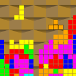

jointris
========

Tetris like game executable and component libraries.

For more info visit http://www.efanomars.com/games/jointris

This source package contains:

- libstmm-jointris:
    library containing jointris specific events

- libstmm-jointris-xml:
    library that extends the xml game definition "language"
    to instantiate events defined in libstmm-jointris

- jointris:
    the game executable of jointris features
    - multiple blocks that can be joined together
    - multiple players collaborating or competing
    - custom shaped blocks and weird rotations
    - exploding bombs

Read the INSTALL file for installation instructions.

Warning
-------
The APIs of the libraries aren't stable yet.
